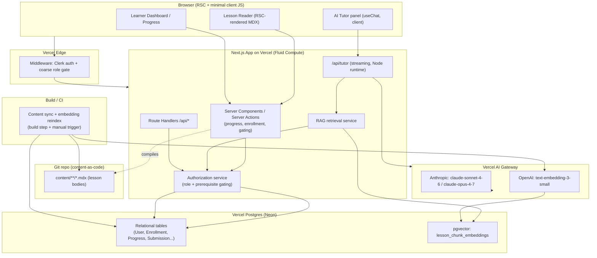

# AI Course App — System Architecture

> Status: Architecture baseline (v1). Owner: Architect.
> Companion docs: [`system-design.md`](./system-design.md), [`tech-decisions.md`](./tech-decisions.md).
> Product framing (personas, scope, success metrics) lives in `PRD.md` (planner-owned). This document references it but does not duplicate it.

---

## 1. Problem Shape (constraints that drive the architecture)

The product is an LMS-style learning platform delivering the curriculum in `curriculum.txt`. Architecturally significant facts pulled from that curriculum:

| Constraint | Source | Architectural consequence |
|---|---|---|
| 4 skill levels, 12 tracks, ~40+ modules, hundreds of sub-lessons | §1.2, §3–§5 | Deep but **finite, mostly static** content hierarchy. Read-heavy. |
| 1,200–2,000 learning hours of content | §1.2.3 | Lesson bodies are large prose/MDX. Must NOT live inline in DB rows or in the JS bundle. |
| Prerequisite gating between levels; capstone pass-gates progression | §2.5, §3.10 | Authorization logic is **content-graph-aware**, not just role-based. |
| Per-level capstones with multi-criterion rubrics | §3.10 rubric | Submissions + structured assessment scoring entities. |
| Built-in AI tutor showcasing good practice (the curriculum *is about* AI tooling) | task brief | Tutor must be a reference implementation: RAG-grounded, cost-disciplined, safety-first. Dogfooding is a product requirement. |
| Content changes over time (tools deprecate fast — Sora, Assistants API) | §1.1.3 | Content must be **versioned**; RAG index must re-sync on content change. |

KISS/YAGNI lens: this is a read-heavy content app with a constrained AI feature and a moderate authz model. It does **not** need microservices, a message bus, a separate vector DB cluster, Kubernetes, or a CMS product. The simplest stack that scales to the content volume is a single Next.js app on Vercel with one Postgres database (Postgres doubles as the vector store via `pgvector`).

---

## 2. Recommended Stack (with justification + one rejected alternative each)

| Layer | Choice | Why | Rejected alternative (and why) |
|---|---|---|---|
| **App framework** | **Next.js 16 (App Router) + TypeScript** | One framework for SSR marketing pages, RSC-rendered lesson reader, Route Handlers for the API, and Server Actions for mutations. First-class on Vercel. Server Components let us render large MDX lesson bodies on the server so they never enter the client bundle. | **Remix / TanStack Start**: viable, but loses the tight Vercel integration (Cache Components, AI SDK, Fluid Compute) and the team's existing Vercel skill set. Not enough upside to offset. |
| **Hosting/platform** | **Vercel** (Fluid Compute functions, Edge for middleware) | Zero-ops deploys, preview environments per PR, native streaming for the AI tutor, built-in CDN for static lesson assets. Matches the org default. | **Self-managed AWS (ECS/Lambda + CloudFront)**: more control, far more ops burden for a content app that doesn't need it. Violates YAGNI. |
| **Database** | **Vercel Postgres (Neon)** + **`pgvector`** | One datastore for relational data (users, enrollments, progress, submissions) AND embeddings. Neon's branching gives a DB-per-preview-environment. Avoids operating a second system. Volume is tiny by Postgres standards (tens of thousands of chunks, not billions). | **Pinecone / dedicated vector DB**: an extra managed service, extra failure mode, extra cost, separate consistency story — unjustified at this corpus size. Revisit only if recall/latency at scale proves inadequate. |
| **ORM / data access** | **Prisma** | Type-safe schema, migrations, good DX. Raw SQL escape hatch (`$queryRaw`) for the `pgvector` similarity query Prisma doesn't model natively. | **Drizzle**: lighter and SQL-first, but Prisma's migration tooling and ecosystem maturity win for a schema this size with multiple writers. Marginal call; documented in `tech-decisions.md`. |
| **Auth** | **Clerk** (native Vercel Marketplace integration) | Hosted auth (email/password, OAuth, magic link), org/role support out of the box, middleware-based route protection, env auto-provisioned via Marketplace. We add a thin app-side **authorization** layer for prerequisite gating (Clerk handles *authentication* + coarse roles; the content graph handles *can-this-user-access-this-lesson*). | **Auth.js (NextAuth)**: free and flexible, but we'd own session storage, account linking, and the admin UX. For a product with instructor/admin roles and a paid-cohort future, hosted auth removes a whole maintenance surface. **Roll-our-own**: rejected outright (security risk, YAGNI). |
| **Lesson content** | **Structured records in Postgres + MDX bodies in the Git repo** (content-as-code), compiled at build with `next-mdx-remote`/`@next/mdx` | The hierarchy (Program→Level→Track→Module→Lesson) and metadata live in DB rows for querying, gating, and progress joins. The *large prose body* of each lesson is an `.mdx` file in `content/` — versioned by Git (free history, diff, PR review, rollback), rendered on the server (zero client-bundle cost), and never bloating DB rows. A build-time sync reconciles content frontmatter → DB records. | **Headless CMS (Sanity/Contentful)**: another vendor, another auth surface, another sync job, recurring cost, and authors here are engineers writing technical MDX with code blocks — Git PR review *is* the editorial workflow. Revisit if non-technical authors are onboarded. **Storing MDX in a DB column**: bloats rows, no diff/review, couples content edits to migrations. Rejected. |
| **AI tutor SDK** | **Vercel AI SDK v6** (`ai` package) | Streaming-first, provider-agnostic, `ToolLoopAgent` for the tutor's tool loop, `embedMany` for ingestion, native Next.js Route Handler + `useChat` integration. | **Direct `@anthropic-ai/sdk`**: lower-level; we'd hand-roll streaming, tool loop, and message-part typing. AI SDK gives end-to-end type safety with `useChat`. |
| **AI model provider** | **Anthropic Claude via Vercel AI Gateway** | Gateway gives one API key surface, per-feature cost tags, and a configured **fallback chain** for provider outages without app code changes. Tutor turns default to **`claude-sonnet-4-6`**; heavier reasoning (capstone feedback synthesis, multi-step planning) routes to **`claude-opus-4-7`**. | **Direct Anthropic API (no gateway)**: simplest for dev, but no failover, weaker cost attribution. Use direct only in local dev; Gateway in preview/prod. |
| **Embeddings** | **OpenAI `text-embedding-3-small`** (via Gateway) | Cheap, strong English retrieval quality, 1536-dim fits `pgvector` comfortably. Anthropic does not ship a first-party embedding model, so the embedder is necessarily a separate provider. | `text-embedding-3-large`: higher cost/storage for marginal gain on this English technical corpus. Start small; the embedding column + reindex job make swapping later a batch operation, not a rewrite. |
| **UI** | **Tailwind CSS + shadcn/ui** | Owned-in-repo components (not a runtime dependency), accessible primitives, fast to assemble a reader/dashboard without shipping a heavy component lib. | A full design-system lib (MUI): heavier bundle, harder to make not look like a template (per design-quality rules). |
| **Validation** | **Zod** | One schema language for API input validation, AI tool `inputSchema`, and structured AI `Output.object()`. | `yup`/manual: Zod is the AI SDK's native schema and gives us reuse across the boundary. |

---

## 3. High-Level Component Diagram



---

## 4. Request / Data Flows

### 4.1 Read a lesson (most common path)
1. Request hits Vercel Edge middleware → Clerk verifies session, attaches `userId` + coarse role.
2. App Router resolves the lesson route (RSC). A Server Component calls the **Authorization service**: is the user enrolled, is the parent level unlocked (prerequisite + prior-capstone-pass check)?
3. If allowed: the lesson's structured metadata is read from Postgres; the lesson **body MDX is compiled at build time** and rendered server-side (no body content in the client bundle). A "lesson started" progress event is written via a Server Action (idempotent upsert).
4. If blocked: render a "locked — complete X first" state with the unmet prerequisite, not a 403 dead end.

### 4.2 Ask the AI tutor (streaming)
1. Client `useChat` POSTs the conversation + current `lessonId` to `/api/tutor` (Node runtime, streaming).
2. Route Handler: (a) rate-limit check (per-user token bucket), (b) authorize the user for that lesson's content, (c) **semantic cache** lookup on the normalized question.
3. On cache miss: embed the query → `pgvector` similarity search **scoped to the current module/track** → assemble grounded context.
4. `ToolLoopAgent` (model `claude-sonnet-4-6`, escalate to `claude-opus-4-7` for flagged hard turns) generates a grounded, streamed answer with citations to lesson sections. Static system prompt + retrieved-corpus block use **Anthropic prompt caching**.
5. Response streamed to the client via `toUIMessageStreamResponse()`. Final answer + embedding written to the semantic cache. Token usage tagged in the Gateway by feature/user.

### 4.3 Submit a capstone
1. Server Action validates the submission payload (Zod) and writes a `Submission` row (status `submitted`).
2. Instructor/admin grades against the rubric criteria, OR an AI-assisted draft assessment is generated (`claude-opus-4-7`, structured `Output.object()` against the rubric schema) for human review — **AI never auto-passes a gate**.
3. On a passing `Assessment`, the Authorization service recomputes the user's unlocked levels (progression gate satisfied).

### 4.4 Content publish / reindex
1. Author opens a PR editing `content/**/*.mdx` + frontmatter. Git is the version history and review workflow.
2. On merge, the build runs the **content sync job**: upsert Level/Track/Module/Lesson records from frontmatter; for changed lessons, re-chunk → re-embed (`text-embedding-3-small`) → upsert into `lesson_chunk_embeddings` (stale chunks for that lesson deleted first). A manual reindex trigger exists for re-embeds without a content change (e.g., embedding model swap).

---

## 5. Rendering Strategy

| Surface | Strategy | Rationale |
|---|---|---|
| Marketing / landing / curriculum overview | **Static (prerendered)** | Public, rarely changes, best LCP. |
| Lesson reader body | **RSC, statically prerendered where possible**, MDX compiled at build | Large prose stays server-side → near-zero client JS for content. Cacheable. |
| Per-user chrome (progress bars, "locked" badges, next-lesson CTA) | **Dynamic RSC** (uncached, user-scoped) — composed via Cache Components / PPR so the static lesson shell streams instantly and the personalized shell hydrates after | Personalization without sacrificing the static body. |
| Learner dashboard | **Dynamic RSC** | Inherently per-user, low traffic relative to reading. |
| AI tutor | **Client component + streamed Route Handler** | Streaming UX requires a client consumer (`useChat`). |

Bundle discipline: lesson bodies never ship as JS. Heavy client libs (e.g., code-block syntax highlighting) are dynamically imported. Targets follow the org web performance budget (app page < 300kb JS gzipped).

---

## 6. Deployment Topology & Environments

```
GitHub repo
  ├─ push to feature branch ─▶ Vercel Preview Deployment
  │                              ├─ Neon DB branch (isolated, seeded)
  │                              └─ AI Gateway (test cost tag, low rate cap)
  ├─ merge to main ──────────▶ Vercel Production
  │                              ├─ Neon main branch (migrations applied)
  │                              ├─ Content sync + embedding reindex (build step)
  │                              └─ AI Gateway (prod cost tag, fallback chain on)
  └─ PR content changes ─────▶ same pipeline; reindex triggered for changed lessons
```

| Environment | DB | AI provider | Notes |
|---|---|---|---|
| **Local dev** | Local Postgres + pgvector (Docker) or a personal Neon branch | Direct Anthropic + OpenAI keys (no Gateway) | Fast iteration; secrets via `.env.local` (gitignored). |
| **Preview** (per PR) | Neon branch off main, seeded with a content subset | AI Gateway, low per-key rate cap, separate cost tag | Safe to break; isolated data. |
| **Production** | Neon main | AI Gateway with ordered fallback (Anthropic primary; secondary provider configured at gateway level) | Cost caps + alerts on the tutor feature tag. |

Runtimes: Edge middleware for auth (low latency). The AI tutor Route Handler runs on the **Node.js runtime on Fluid Compute** (streaming + longer-lived connections + Prisma compatibility). Standard CRUD Route Handlers and Server Actions run on Node serverless functions.

---

## 7. Cost & Reliability Posture (summary; detail in system-design.md §AI)

- **Model routing**: `claude-sonnet-4-6` for normal tutor turns; `claude-opus-4-7` only for explicitly hard turns (multi-step reasoning, capstone feedback synthesis). A cheap classifier/heuristic decides escalation — never default to Opus.
- **Caching, three layers**: (1) Anthropic **prompt caching** on the stable system prompt + retrieved corpus block; (2) **semantic cache** (embedding-keyed) on Q&A in Postgres so repeated/near-duplicate cohort questions skip generation entirely; (3) Vercel data cache on retrieval results for hot lessons.
- **Rate limiting**: per-user token-bucket on `/api/tutor` (in-DB or Vercel KV counter) to bound spend and abuse; Gateway-level per-key caps as a backstop.
- **Failover**: AI Gateway ordered fallback so a single-provider outage degrades gracefully rather than 500-ing the tutor.

---

## 8. What we explicitly are NOT building (YAGNI guardrails)

- No microservices / no separate API gateway service — one Next.js app.
- No dedicated vector database — `pgvector` until proven insufficient.
- No headless CMS — content-as-code in Git.
- No message queue / event bus — Server Actions + a build-time sync job cover current needs.
- No real-time collaboration, no video pipeline, no mobile app (out of scope for v1; see `PRD.md`).
- No multi-region active-active DB — single-region Neon with read replicas only if/when latency data demands it.
