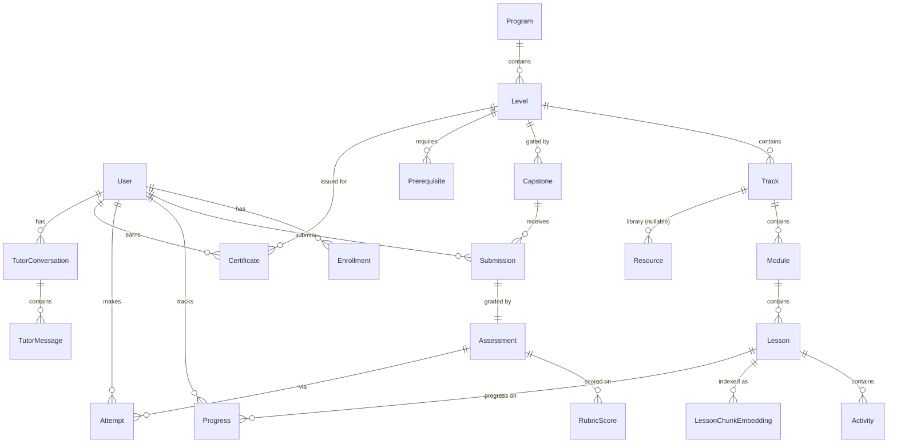

# AI Course App — System Design

> Companion to [`architecture.md`](./architecture.md). Product framing in `PRD.md` (planner-owned).
> This document specifies the data model, API surface, the AI tutor RAG pipeline, the auth/authz model, and the security posture.

---

## 1. Data Model

### 1.1 Design notes

- The content hierarchy mirrors the curriculum: **Program → Level → Track → Module → Lesson → Activity**, with **Capstone** attached at Level scope (per-level capstones in §3.10) and optionally Module scope.
- **Content/structure** (queryable, gating-relevant) lives in relational tables. **Lesson prose** lives as MDX in Git; the DB stores a `bodyPath` + `contentHash`, never the body itself.
- Everything user-progress-related is an append-friendly, idempotent upsert keyed by `(userId, entityId)` so repeated client events don't corrupt state.
- Embeddings live in their own table so reindexing never touches lesson rows or locks the content tables.
- **Resource** is a first-class content entity (added by ADR-007). An earlier draft of §1.3 omitted it; CLAUDE.md §10 mandates a Resource Library and lists Resource in the recommended data model, so the table spec below now includes it.

### 1.2 Entities (ER overview)



### 1.3 Table specifications (essential fields)

| Entity | Purpose | Key fields |
|---|---|---|
| **User** | Account. Authn owned by Clerk; this row is the app-local mirror keyed by Clerk user id. | `id`, `clerkUserId` (unique), `email`, `role` (`learner` \| `instructor` \| `admin`), `createdAt` |
| **Program** | Top-level container (the whole programme). | `id`, `slug`, `title`, `version` |
| **Level** | One of the 4 skill levels. | `id`, `programId`, `order` (1–4), `slug`, `title`, `estimatedHoursMin/Max` |
| **Track** | One of the 12 tracks. A track spans levels, so the `(track, level)` pairing is what a learner enrolls/progresses against. | `id`, `slug`, `title`, `focusEcosystem` |
| **Module** | A numbered module (e.g. `3.1`, `4.1`). | `id`, `levelId`, `trackId`, `code` (`"4.1"`), `order`, `title` |
| **Lesson** | A teachable unit (e.g. `4.1.1`). Body is MDX in Git. | `id`, `moduleId`, `code`, `order`, `title`, `bodyPath` (repo path), `contentHash`, `estMinutes` |
| **Activity** | An exercise / lab / quiz inside a lesson. | `id`, `lessonId`, `type` (`exercise`\|`quiz`\|`lab`), `order`, `spec` (JSON) |
| **Resource** | Resource Library entry — searchable/filterable learning material (docs, cheat sheets, prompt templates, tool guides, etc.). Added per ADR-007 (CLAUDE.md §10 mandates a Resource Library and the CLAUDE.md recommended data model lists Resource; omitting it here was an oversight). `id` is the content contract's stable slug; either `url` (external) or `assetPath` (self-hosted) may be set; `trackId` is a nullable FK so a global resource needs no track. | `id`, `title`, `type` (enum, 11 kinds), `url?`, `assetPath?`, `trackId?`, `levelOrder?`, `topic?`, `difficulty?` |
| **Capstone** | Per-level (or per-module) project with brief + rubric. | `id`, `levelId`, `title`, `briefPath`, `rubricId` |
| **Rubric** / **RubricCriterion** | Structured scoring grid (Emerging→Advanced). | `Rubric{id,title}`; `RubricCriterion{id, rubricId, name, weight, level1Desc..level4Desc}` |
| **Submission** | A learner's capstone submission. | `id`, `userId`, `capstoneId`, `artifactUrl`/`payload` (JSON), `status` (`submitted`\|`graded`\|`returned`), `submittedAt` |
| **Assessment** | The grading record for a submission. | `id`, `submissionId` (unique), `graderId` (user or `system`), `mode` (`human`\|`ai_draft_human_confirmed`), `totalScore`, `outcome` (`pass`\|`merit`\|`distinction`\|`fail`), `gradedAt` |
| **RubricScore** | Per-criterion score within an assessment. | `id`, `assessmentId`, `criterionId`, `score` (1–4), `comment` |
| **Attempt** | An attempt at a graded activity/assessment (quizzes, retries). | `id`, `userId`, `activityId`/`assessmentId`, `score`, `passed`, `attemptedAt` |
| **Progress** | Per-user per-lesson state. Idempotent upsert. | `id`, `userId`, `lessonId`, `status` (`not_started`\|`in_progress`\|`completed`), `completedAt`, `lastSeenAt` (unique `(userId,lessonId)`) |
| **Enrollment** | User ↔ (Track, Level) enrollment + cohort. | `id`, `userId`, `trackId`, `levelId`, `cohortId?`, `status`, `enrolledAt` |
| **Prerequisite** | Directed gating edge: a Level requires another Level (and/or a capstone pass). | `id`, `levelId`, `requiresLevelId`, `requiresCapstonePass` (bool) |
| **Certificate** | Issued on level completion. | `id`, `userId`, `levelId`, `serial` (unique), `issuedAt`, `revokedAt?` |
| **LessonChunkEmbedding** | RAG index. Separate table; reindex-safe. | `id`, `lessonId`, `moduleId`, `trackId`, `chunkIndex`, `text`, `embedding vector(1536)`, `contentHash`; index: HNSW on `embedding` |
| **TutorConversation / TutorMessage** | Persisted tutor chat for continuity + audit. | `Conversation{id,userId,lessonId?,createdAt}`; `Message{id,conversationId,role,parts(JSON),tokensIn,tokensOut,model,createdAt}` |
| **SemanticCacheEntry** | Embedding-keyed Q&A cache (cost control). | `id`, `scopeKey` (e.g. `module:4.1`), `queryEmbedding vector(1536)`, `question`, `answer`, `citations(JSON)`, `hitCount`, `createdAt` |
| **TutorRateBucket** | Per-user token-bucket counter for `/api/tutor`. | `userId` (pk), `tokens`, `refillAt` |

Indexes that matter: `Progress(userId, lessonId)` unique; `LessonChunkEmbedding` HNSW vector index + btree on `moduleId`/`trackId` for scoped retrieval; `Submission(userId, capstoneId)`; `Enrollment(userId, trackId, levelId)`.

---

## 2. API Surface

REST-style Route Handlers under `/api`; user-state mutations triggered from the reader use **Server Actions** (no public endpoint needed). Every endpoint validates input with Zod and is authorized server-side.

### 2.1 Content (read, mostly cacheable)

| Method | Route | Purpose |
|---|---|---|
| GET | `/api/programs/:slug` | Program + level/track outline. |
| GET | `/api/levels/:id` | Level detail, modules, lock state for current user. |
| GET | `/api/tracks/:id` | Track detail across levels. |
| GET | `/api/modules/:id` | Module + ordered lessons. |
| GET | `/api/lessons/:id` | Lesson metadata (body rendered via RSC, not this endpoint). |

### 2.2 Progress & enrollment

| Method | Route / Action | Purpose |
|---|---|---|
| Server Action | `markLessonProgress(lessonId, status)` | Idempotent upsert of `Progress`. |
| POST | `/api/enrollments` | Enroll user in a (track, level); checks prerequisites. |
| GET | `/api/me/progress` | Aggregated progress + unlocked-level map for dashboard. |
| GET | `/api/me/certificates` | Issued certificates. |

### 2.3 Capstones & assessment

| Method | Route | Purpose |
|---|---|---|
| POST | `/api/capstones/:id/submissions` | Create a submission (Zod-validated). |
| GET | `/api/submissions/:id` | Fetch submission + assessment (owner or instructor). |
| POST | `/api/submissions/:id/assessment` | Instructor grades, OR request AI draft (instructor-only). |
| POST | `/api/submissions/:id/assessment/confirm` | Instructor confirms an AI-drafted assessment (the action that can satisfy a gate). |

### 2.4 AI tutor

| Method | Route | Purpose |
|---|---|---|
| POST | `/api/tutor` | Streaming grounded Q&A. Body: `{messages, lessonId}`. Rate-limited, authorized, RAG-grounded. Returns `toUIMessageStreamResponse()`. |
| GET | `/api/tutor/conversations` | List the user's prior tutor conversations. |

### 2.5 Admin / content ops

| Method | Route | Purpose |
|---|---|---|
| POST | `/api/admin/reindex` | Trigger embedding reindex (admin-only; also runs in build). Body: optional `lessonId` for targeted reindex. |
| GET | `/api/admin/cohorts` | Manage cohorts/enrollments (instructor/admin). |

---

## 3. AI Tutor RAG Pipeline

Reference implementation goal: the tutor itself demonstrates the curriculum's own best practices (grounding, citations, prompt caching, semantic caching, cost discipline, input/output safety) — dogfooding §1.3.

### 3.1 Ingestion (build-time / on content change)

```
content/**/*.mdx changed (PR merged)
  → parse MDX, strip frontmatter, normalize headings/code fences
  → chunk: heading-aware, ~700–900 tokens, ~15% overlap, never split a code block
  → embedMany(text-embedding-3-small)  // batched, via AI Gateway
  → DELETE old chunks for lessonId, INSERT new rows into LessonChunkEmbedding
     (carry lessonId, moduleId, trackId, contentHash for scoped retrieval + staleness)
```

Idempotent and incremental: only lessons whose `contentHash` changed are re-embedded. A full reindex (admin trigger) handles an embedding-model swap.

### 3.2 Retrieval (per request)

```
incoming question + lessonId
  → derive scope (moduleId, trackId from the lesson)
  → semantic cache lookup: embed question, cosine search SemanticCacheEntry within scopeKey
       ↳ HIT (similarity ≥ threshold) → return cached answer, skip generation
  → MISS: embed question (reuse the embedding)
  → pgvector ANN search on LessonChunkEmbedding
       WHERE moduleId = ? (scoped first; widen to trackId if top-k confidence low)
       ORDER BY embedding <=> :queryVec LIMIT k(=6)
  → assemble grounded context block with source anchors (lesson code + heading)
```

### 3.3 Grounded generation

```
ToolLoopAgent:
  model      = claude-sonnet-4-6   (default)
             = claude-opus-4-7     (escalation: multi-step reasoning / capstone feedback)
  system     = static tutor persona + grounding rules  ── Anthropic prompt-cache breakpoint
  context    = retrieved chunks block                   ── prompt-cache breakpoint (stable per lesson)
  user       = conversation tail + question
  rules      = "answer only from provided context; cite lesson code+section;
                if context insufficient, say so and point to the lesson — do not invent"
  → stream via toUIMessageStreamResponse()
  → on completion: persist TutorMessage (tokens, model), upsert SemanticCacheEntry,
                    tag spend in AI Gateway by feature/user
```

Escalation heuristic (cheap, deterministic, runs before generation): route to `claude-opus-4-7` only when the turn is flagged hard (e.g. capstone-feedback context, explicit multi-step planning request, or low retrieval confidence requiring synthesis). Default path is Sonnet. Opus is never the default.

### 3.4 Cost controls (mapped to curriculum's own teachings — §1.3.2, §2.2)

| Lever | Mechanism |
|---|---|
| Prompt caching | Stable system prompt + per-lesson retrieved block marked as cache breakpoints (Anthropic cache control). Repeated turns in a lesson reuse cached prefix. |
| Semantic cache | Embedding-keyed Q&A store; near-duplicate cohort questions return cached answers with zero generation tokens. |
| Model routing | Sonnet default, Opus only on escalation; classifier cost ≪ generation cost. |
| Retrieval scoping | Search the current module first → smaller, cheaper, more relevant context; widen only on low confidence. |
| Rate limiting | Per-user token bucket caps worst-case spend and abuse. |
| Observability | Gateway cost tags per feature/user; alert on tutor-tag spend anomalies. |

---

## 4. Auth & Authorization Model

### 4.1 Authentication
- **Clerk** handles identity (email/password, OAuth, magic link), sessions, and the sign-in/up UI.
- Edge **middleware** validates the session on every request and injects `userId` + coarse `role`.
- App-local `User` row mirrors the Clerk user (created/synced on first authenticated request or via Clerk webhook).

### 4.2 Roles (coarse, RBAC)

| Role | Capabilities |
|---|---|
| `learner` | Read enrolled/unlocked content, submit capstones, use tutor, view own progress/certs. |
| `instructor` | All learner caps + grade submissions, request/confirm AI-draft assessments, manage cohort enrollments. |
| `admin` | All instructor caps + content reindex, role management, cohort/program admin. |

### 4.3 Prerequisite gating (content-graph authorization — the non-trivial part)

Authorization for content is **not** purely role-based. A single `canAccess(user, lesson)` service decides:

```
canAccessLesson(user, lesson):
  if user.role in {instructor, admin}: allow            // staff bypass for review
  enrollment = find Enrollment(user, lesson.track, lesson.level)
  if not enrollment: deny("not enrolled")
  level = lesson.level
  for each Prerequisite p of level:
      if not levelCompleted(user, p.requiresLevelId): deny("prerequisite: <level>")
      if p.requiresCapstonePass and not capstonePassed(user, p.requiresLevelId):
          deny("capstone not passed: <level>")
  allow

levelCompleted(user, levelId):
  all lessons in level have Progress.status = completed
  AND required capstone(s) have an Assessment.outcome in {pass, merit, distinction}
```

- Gating is evaluated server-side in RSC (for rendering lock states) and re-checked in every state-changing endpoint (defense in depth — never trust the client's idea of what's unlocked).
- Progression is satisfied **only** by a confirmed `Assessment` (human, or AI-drafted then human-confirmed). The AI tutor and AI draft-grader can never auto-unlock a gate.

---

## 5. Security Posture

Aligned with the org's web security baseline.

### 5.1 Secrets
- All provider keys (Anthropic/OpenAI via Gateway, Clerk, database URL) are environment variables, never in source. Local: `.env.local` (gitignored). Preview/prod: Vercel encrypted env + Marketplace auto-provisioned (Clerk, Neon). Required-secret presence asserted at startup; missing secret = fail fast, not silent degrade.

### 5.2 Input validation
- Every API/Server Action input parsed with **Zod** at the boundary; reject on parse failure with a safe message.
- The tutor endpoint additionally: enforces a max message length and conversation depth; the question is treated as untrusted and is **only ever placed in the user turn**, never concatenated into the system prompt (prompt-injection containment, per OWASP ASI02 which the curriculum itself teaches).

### 5.3 AI-specific safety (dogfooding the curriculum's safety-first principle)
- **Grounding contract**: the tutor answers only from retrieved lesson context and must cite; "I don't have that in the material" is an acceptable answer. Reduces hallucination and injection blast radius.
- **Least agency**: the tutor has no write tools. Its tool surface is read-only retrieval. It cannot mutate progress, grades, or enrollment.
- **Output handling**: model output rendered as sanitized markdown (no raw HTML injection from model text).
- **No auto-gating**: reiterated — AI output is advisory; gate transitions require a human-confirmed assessment.

### 5.4 Rate limiting & abuse
- `/api/tutor`: per-user token-bucket (`TutorRateBucket`, atomic upsert) bounding requests/tokens per window; AI Gateway per-key cap as a backstop; cost-anomaly alerts on the tutor spend tag.
- Auth-gated endpoints reject unauthenticated requests at the edge before reaching compute.

### 5.5 Transport & headers
- HTTPS only; HSTS. Security headers per the web baseline: `X-Content-Type-Options: nosniff`, `X-Frame-Options: DENY`, `Referrer-Policy: strict-origin-when-cross-origin`, restrictive `Permissions-Policy`.
- **CSP**: nonce-based `script-src 'self' 'nonce-…'` (no blanket `unsafe-inline` for scripts); `connect-src` limited to self + Clerk + the AI Gateway origin; `frame-src 'none'`; `object-src 'none'`; `base-uri 'self'`. Tune origins to the actual deployed providers — do not ship the example block unchanged.

### 5.6 Data
- Parameterized queries everywhere (Prisma; `$queryRaw` with bound params for the `pgvector` search — never string-interpolate the vector or filters).
- Submissions may contain learner PII/work product → access scoped to owner + instructor/admin; not embedded into the RAG index.
- Certificates carry a unique serial for verification; revocation supported.

---

## 6. Open Questions for Planner / PRD

1. Is content authoring engineer-only (justifies content-as-code) or do non-technical authors need a CMS later? (Affects the content layer decision in `tech-decisions.md`.)
2. Cohort/billing model — affects whether `Enrollment.cohortId` and a payments integration are v1 or later.
3. AI-assisted grading: is the AI *draft* assessment in v1, or is grading fully manual at launch? (Pipeline supports both; default assumption here = manual at launch, AI draft is opt-in instructor tool.)
